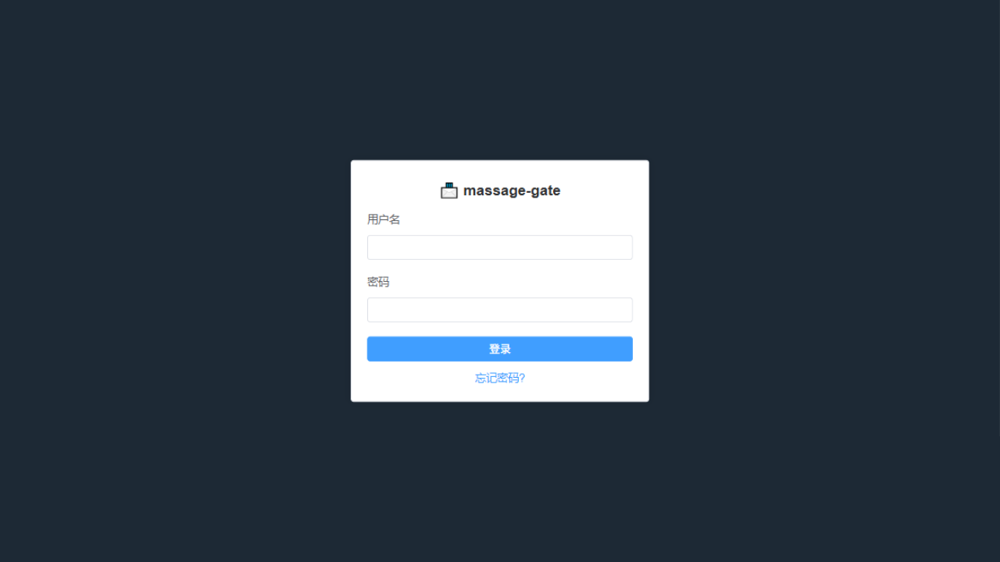
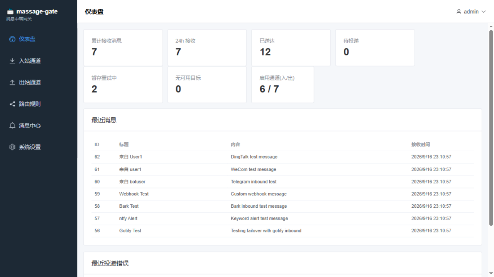
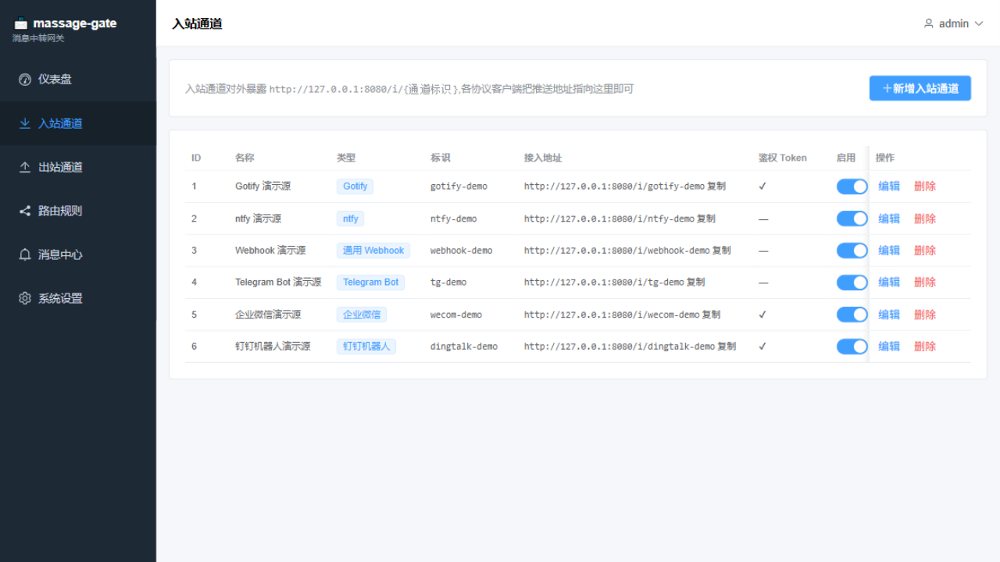
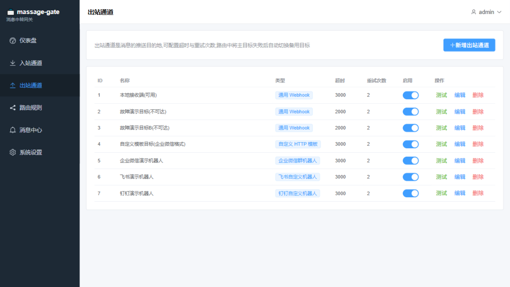
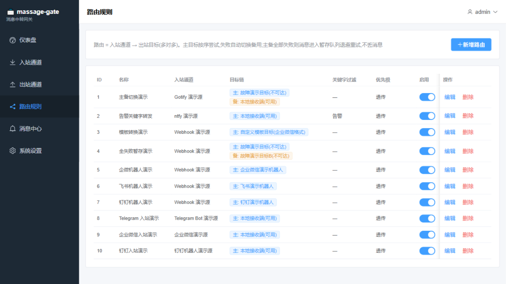
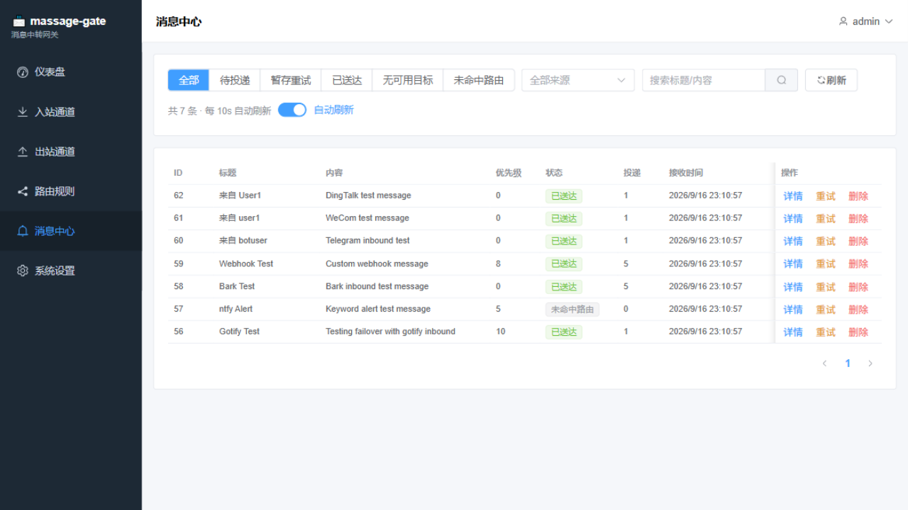

# 📨 Massage Gate

[](https://go.dev/)
[](https://vuejs.org/)
[](LICENSE)

**消息网关 / 消息路由器** - 统一多种消息协议，支持主备切换与暂存重试。

## 📸 截图

| 登录页面 | 仪表盘 |
|:---:|:---:|
|  |  |

| 入站通道 | 出站通道 |
|:---:|:---:|
|  |  |

| 路由规则 | 消息中心 |
|:---:|:---:|
|  |  |

## ✨ 功能特性

### 入站协议支持

| 协议 | 说明 |
|------|------|
| **Gotify** | 兼容 Gotify 客户端，支持优先级和点击链接 |
| **ntfy** | 支持 JSON 和 Header 两种发布模式 |
| **Bark** | 支持 GET 路径式和 POST JSON 两种方式 |
| **Webhook** | 通用 JSON，可配置字段提取路径 |
| **Telegram Bot** | Webhook 回调，自动解析消息和发送者 |
| **企业微信** | 应用回调消息，支持 XML/JSON |
| **钉钉机器人** | Outgoing 回调，支持加签验证 |

### 出站协议支持

| 协议 | 说明 |
|------|------|
| **Gotify** | 推送到 Gotify 服务端 |
| **ntfy** | 推送到 ntfy 服务端 |
| **Bark** | 推送到 iOS Bark 客户端 |
| **Telegram Bot** | 通过 Bot API 发送消息 |
| **企业微信** | 群机器人 Webhook |
| **飞书** | 自定义机器人，支持签名校验 |
| **钉钉** | 自定义机器人，支持加签 |
| **Webhook** | 通用 HTTP POST |
| **自定义模板** | 自定义请求体模板 |

### 核心功能

- **消息路由**: 入站通道 → 路由规则 → 出站目标
- **主备切换**: 主目标失败自动切换备用目标
- **暂存重试**: 全部失败后进入暂存队列，指数退避重试
- **关键字过滤**: 按关键字过滤消息
- **模板转换**: 标题/正文模板渲染
- **优先级映射**: 支持透传、固定、映射三种模式

## 📦 编译安装

### 环境要求

- Go 1.21+
- Node.js 18+ (仅编译前端需要)

### 编译步骤

```bash
# 克隆仓库
git clone https://github.com/yourname/massage-gate.git
cd massage-gate

# 编译前端 (可选，已包含预编译产物)
cd web-src && npm install && npm run build && cd ..
cp -r web-src/dist internal/web/

# 编译后端
go build -o massage-gate ./cmd/server

# Windows PowerShell
.\build.ps1
```

### Docker 构建

```bash
docker build -t massage-gate .
docker run -d -p 8080:8080 -v ./data:/app/data massage-gate
```

## 🚀 快速开始

### 启动服务

```bash
# Linux/macOS
./massage-gate -data ./data

# Windows
.\massage-gate.exe -data .\data
```

服务启动后访问 http://localhost:8080

### 初始化

首次访问会进入初始化页面，设置用户名和密码。

### 添加入站通道

1. 点击「入站通道」→「新增」
2. 选择协议类型，填写通道标识 (如 `my-gotify`)
3. 接入地址: `http://your-server:8080/i/my-gotify`

### 添加出站通道

1. 点击「出站通道」→「新增」
2. 选择协议类型，填写配置 (如 Webhook URL)
3. 可点击「测试」验证配置

### 配置路由

1. 点击「路由」→「新增」
2. 选择入站通道
3. 添加目标 (主目标 + 备用目标)
4. 可配置关键字过滤、模板转换

## 📖 使用示例

### Gotify 客户端配置

```
服务器地址: http://your-server:8080/i/gotify-code
发送路径: /message?token=your-token
```

### Telegram Bot 配置

```bash
# 设置 Webhook
curl -X POST "https://api.telegram.org/bot<TOKEN>/setWebhook?url=http://your-server:8080/i/tg-code"
```

### 企业微信应用配置

在企业微信后台配置回调 URL: `http://your-server:8080/i/wecom-code`

### 钉钉机器人配置

在群机器人中开启 Outgoing，POST 地址: `http://your-server:8080/i/dingtalk-code`

### curl 测试

```bash
# Gotify
curl -X POST "http://localhost:8080/i/my-gotify?token=xxx" \
  -H "Content-Type: application/json" \
  -d '{"title":"Test","message":"Hello"}'

# ntfy
curl -X POST "http://localhost:8080/i/my-ntfy" \
  -H "Content-Type: application/json" \
  -d '{"title":"Alert","message":"CPU 90%"}'

# Webhook
curl -X POST "http://localhost:8080/i/my-webhook" \
  -H "Content-Type: application/json" \
  -d '{"title":"Event","message":"User login"}'
```

## 🏗️ 项目结构

```
massage-gate/
├── cmd/
│   ├── server/main.go    # 服务入口
│   └── seed/main.go      # 示例数据注入
├── internal/
│   ├── adapter/          # 协议适配器
│   │   ├── adapter.go    # 接口定义
│   │   ├── senders.go    # 出站发送器
│   │   ├── bots.go       # 企业微信/飞书/钉钉
│   │   └── httpx.go      # HTTP 工具
│   ├── api/              # REST API
│   ├── config/           # 配置解析
│   ├── dispatch/         # 投递调度器
│   ├── inbound/          # 入站解析器
│   ├── store/            # 数据模型
│   └── web/              # 前端静态文件
├── web-src/              # Vue 前端源码
├── data/                 # 数据目录
└── docs/                 # 文档和截图
```

## 🔧 配置说明

### 命令行参数

| 参数 | 默认值 | 说明 |
|------|--------|------|
| `-data` | `./data` | 数据目录 |
| `-addr` | `:8080` | 监听地址 |

### 重置密码

如果忘记密码，可以通过命令行工具重置：

```bash
# Linux/macOS
./resetpw -password newpassword

# Windows
.\resetpw.exe -password newpassword

# 指定数据目录
./resetpw -data /path/to/data -password newpassword
```

### 全局设置

在「设置」页面可配置:

- **消息保留天数**: 自动清理历史消息
- **默认超时**: 出站请求默认超时时间
- **退避基数**: 暂存重试的初始间隔
- **退避上限**: 暂存重试的最大间隔

## 📊 API 文档

### 认证

```bash
# 登录 (返回 session cookie)
POST /api/login
{"username": "admin", "password": "xxx"}

# 登出
POST /api/logout
```

### 入站通道

```bash
GET    /api/sources
POST   /api/sources
PUT    /api/sources/:id
DELETE /api/sources/:id
```

### 出站通道

```bash
GET    /api/targets
POST   /api/targets
PUT    /api/targets/:id
DELETE /api/targets/:id
POST   /api/targets/:id/test  # 测试出站
```

### 路由

```bash
GET    /api/routes
POST   /api/routes
PUT    /api/routes/:id
DELETE /api/routes/:id
```

### 消息

```bash
GET    /api/messages          # 消息列表
GET    /api/messages/:id      # 消息详情
POST   /api/messages/:id/retry # 手动重试
DELETE /api/messages/:id      # 删除消息
```

## 🛠️ 开发

### 添加新的入站协议

1. 在 `internal/inbound/inbound.go` 中添加解析函数
2. 在 `parse()` 函数中注册新类型
3. 更新 `internal/api/api.go` 中的 `sourceTypes`
4. 更新前端 `api.js` 中的 `SOURCE_TYPES`

### 添加新的出站协议

1. 在 `internal/adapter/` 中实现 `Sender` 接口
2. 在 `init()` 中调用 `RegisterSender()`

```go
func init() {
    RegisterSender("new-protocol", NewProtocolSender{})
}
```

## 📝 License

MIT License